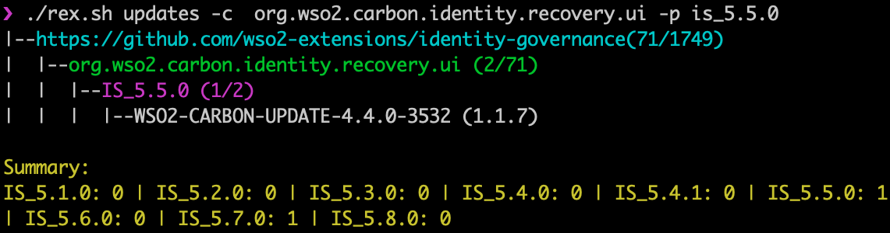

# Repo Explorer (rEx) for Identity Server (IS)

# Happy rEx*ing*!

[WSO2 Identity Server](https://wso2.com/identity-and-access-management/) is 100% open source!. The product maintains the source code under two GitHub organizations: [wso2](https://github.com/wso2) and [wso2-extensions](https://github.com/wso2-extensions). These two GitHub organizations carry code related to all WSO2 products, with hundreds of repositories. Sometimes it's hard to find, which jar file comes from which repo. We built rEx to address that concern.



## Setup

Step-1: The tool relies on Docker, so make sure you have Docker running in your local environment.

Step-2: Copy rex.sh to a directory where you want to maintain Identity Server git repositories. Alway better to keep this readonly. 
```markdown
wget https://github.com/prabath/wso2is-repo-explorer/raw/master/rex.sh
chmod +x rex.sh
```
Also please make sure that you have Internet access, while running the tool.

## Updates

There are three components need to be updated. The rex.sh - will have minimal updates. Any changes to the core of the tool would require updating the Docker image. The indexes will get updated every four hours.

The tool will detect all the updates and will automatically install them.

```markdown
Last indexed at Mon Jul 15 00:10:21 PDT 2019
```
The following command updates metadata related to all Identity Server repos. Usually you do not need to do it manually, as the tool detects any new updates and automatically updates the indexes.

```markdown
./rex.sh update-index
```
## Community

rEx is an open source project (under Apache 2.0 lincense) and any contributions from the wider community is much appreciated. We welcome contribution from the community. Please check the source code at [https://github.com/prabath/wso2is-repo-explorer](https://github.com/prabath/wso2is-repo-explorer)

Report any issues: [https://github.com/prabath/wso2is-repo-explorer/issues](https://github.com/prabath/wso2is-repo-explorer/issues)

## Usage 

### Repository Operations 

Clones all Identity Server related repositories. This is not a required step to run other commands.

```markdown
./rex.sh clone
```
Lists out all Identity Server related repositories. You can do this, even without cloning all repos.

```markdown
./rex.sh list
```
Updates all Identity Server related repositories. If there are any new repos, those will be cloned. 

```markdown
./rex.sh update
```
### Search Operations 

Finds the git repo(s), by the given name. You can do this, even without cloning all repos. The -c option will narrow down the search results for the given component name (or jar file name without version)

```markdown
./rex.sh find org.wso2.carbon.identity.authenticator.mutualssl
```

```markdown
./rex.sh find -c org.wso2.carbon.identity.authenticator.mutualssl
```

```markdown
./rex.sh find OAuth2TokenValidator
```

```markdown
./rex.sh find OAuth2TokenValidator.java
```

```markdown
./rex.sh find samlsso
```
### Product Updates (Patches) 

Lists the git repo(s), along with all the corresponding updates since IS 5.2.0. ***The product updates are provided via WSO2 Update Manager ([WUM](https://wso2.com/updates/wum)). These updates are not open source and provided only to the WSO2 customers and trial users. This tool does not provide any updates - but simply uses the publicly available metadata via the WUM tool to generate some useful information.***

```markdown
./rex.sh updates
```

Lists the git repo(s), along with all the updates since IS 5.2.0 for the given component name (jar file name without version).

```markdown
./rex.sh updates -c  org.wso2.carbon.identity.recovery.ui
```

Lists the updates along with all the components since IS 5.2.0 for the given repo.

```markdown
./rex.sh updates -r carbon-identity-framework
```
Lists the updates by all the product versions.

```markdown
./rex.sh updates -p
```
Lists the updates by the given product version.

```markdown
./rex.sh updates -p IS_5.2.0
```
